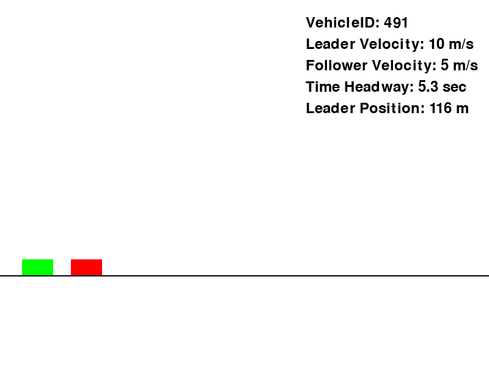
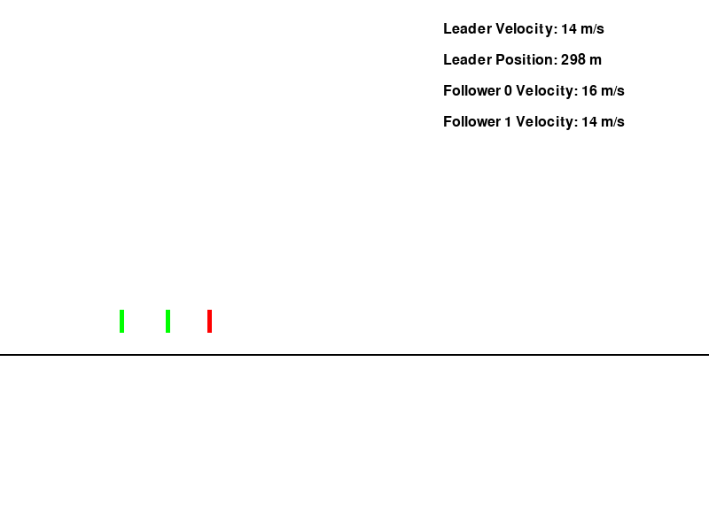

# CACC-RL

## Introduction

This is a Outstanding Scholars research project under Dr. Ahmed Hamdi Sakr by Steven Fung at the University of Windsor. The goal is to establish single and multi-agent reinforcement learning environments that can train for cooperative active cruise control (CACC) behaviour.

Given a set of follower cars and one leader car, the goal is to keep a distance and time headway between itself and the vehicle in front of it. 

[Gymnasium](https://gymnasium.farama.org/) and [PettingZoo](https://pettingzoo.farama.org/) are used to create our single-agent and multi-agent reinforcement learning environments respectively. [stable-baselines3](https://stable-baselines3.readthedocs.io/en/master/) and [AgileRL](https://www.agilerl.com/) are the main libraries for the reinforcement learning algorithms used. 

## Learning

Reinforcement learning is a complex topic that requires understanding of advanced data structures, dynamic programming and machine learning to fully grasp what is happening. Regardless, it is important to gain a base-level understanding of the concepts, and reading up on the basics is your most effective method. I enjoyed reading this [blog post by Lilian Weng](https://lilianweng.github.io/posts/2018-02-19-rl-overview/#deep-q-network). 

As well, many of the concepts and ideas used to create these environments stem from the follow [research paper](https://ieeexplore.ieee.org/document/10575987), coauthored by Dr. Sakr. 

Based on your background, there might be more or less time needed to understand these concepts. My advice is to keep at it!

## Dependencies

Please create a virtual environment in Python using [conda](https://docs.conda.io/projects/conda/en/latest/index.html). Use the documentation to install and set up your own virtual environment. Once set up, use the *rl2.yml* document to [download](https://docs.conda.io/projects/conda/en/latest/user-guide/tasks/manage-environments.html#creating-an-environment-from-an-environment-yml-file) all the needed dependencies. 

`conda env create -f rl.yml`

Note: Some dependencies require you to install [Microsoft Visual Studio Build Tools](https://visualstudio.microsoft.com/downloads/?q=build+tools#build-tools-for-visual-studio-2022). 

## Datasets

The leader car follows car velocity data from [NGSIM datasets](https://datahub.transportation.gov/stories/s/Next-Generation-Simulation-NGSIM-Open-Data/i5zb-xe34/). 

A specific dataset was taken and downloaded as a *.csv*, found in the `data` folder. `parsedata.py` is the original script used to convert the velocity profile of each car to a *.json* file, which the environment refers to during training. 

Note: conversions were made in the environment to change the units to metric. 

## Custom Environments 

Within `gym_followCar`, there are two custom environments and miscellaneous utils. Both environments follow the same standard parameters, just with different number of cars: 
- Timestep: 100ms
- Maximum Distance: 1000m
- Max. Velocity : 33m/s
- Min. and Max. Acceleration: -3 m/s2 to 3 m/s2

`followCarEnvironment-v1.py` is the single-agent environment made with Gymnasium. It follows the same general structure as their [custom environment tutorials](https://gymnasium.farama.org/tutorials/gymnasium_basics/environment_creation/#sphx-glr-tutorials-gymnasium-basics-environment-creation-py).

`multiCarEnv.py` is the multi-agent environment made with PettingZoo. It follows the same general structure as their [custom environment tutorials](https://pettingzoo.farama.org/tutorials/custom_environment/).

In the `tutorials` folder, you will be able to find a Juypter notebook that annotates the process in `multiCarEnv.py`. Similar concepts can be used to understand `followCarEnvironment-v1.py`. 

It is important to include an `__init__.py` script to allow your training script to access the environments. 

To test the validity of the multi-agent environment, different [PettingZoo test utils](https://pettingzoo.farama.org/content/environment_tests/) were used in `testEnvironment.py`.

## Training
Within `training`, you can find the main scripts used to training on both the single-agent and the multi-agent environment. 

`followCarAgentTD3.py` uses the TD3 algorithm with *stable-baselines3* to train on the single-agent environment. After training, the model is saved in the main folder. 

`followCarAgileRL_TD3.py` uses the TD3 algorithm with *AgileRL* to train on the single-agent environment. The general script structure closely resembles the [tutorials](https://docs.agilerl.com/en/latest/tutorials/gymnasium/agilerl_td3_tutorial.html). At the end of training, the elite agent will be saved as a *.pt* file. 

`multiCarAgent.py` uses the MATD3 algorithm with *AgileRL* to train on the single-agent environment. The general script structure closely resembles the [tutorials](https://docs.agilerl.com/en/latest/tutorials/pettingzoo/matd3.html) as well. At the end of training, the elite agent will be saved as a *.pt* file. As well, training performance is monitored using the average reward during training, and a plot is generated when it is finished. 

## Results

Once training is finished, a model will be saved either as a *.zip* or a *.pt* (based on the library). Using `agentTest.py`, the initial parameters can be changed to test your results. You will be able to generate a visualization of your trained agent in the environment.

For the single-agent results, plots are generated displaying key properties within a folder. Example results can be found in `SB3`.

Specifically for the multi-agent results, different files will be generated for reference. An Excel sheet is generated with all the values during the test episode run. As well, plots are generated that visualize the same information in the Excel sheet. 

Currently, the multi-agent is not training with the exact behavior that is desired. Given just one follower car (like single-agent), it is able to track and follow, but with more follower cars, failure in training is seen. Results can be seen in `MATD3`.

## Next Steps 

The goal is to get both environments to train properly. For fixing the multi-agent environment, different ideas that can be looked at are: 
- Distributed vs. shared reward
- Curriculum training
- Fine-tuning of reward function parameters 
- Tuning of initial position and velocity for follower cars

As well, using different libraries such as *stable-baselines3* or *RLLib* could also prove to work, but initially I don't seem to think there is an issue with AgileRL, and I think some main issue lies in `multiCarEnv.py`. 
